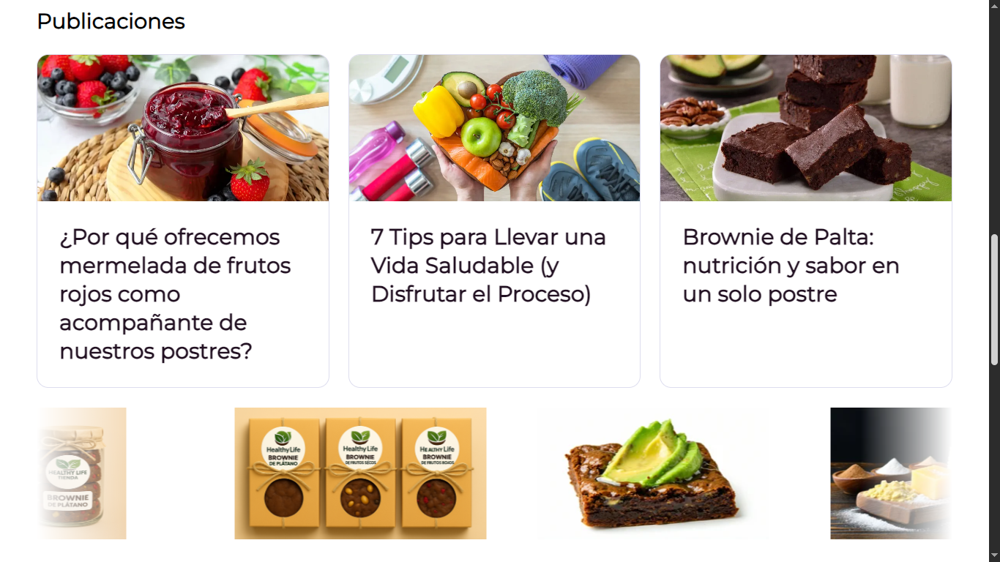

# Healthy-life

A page made 100% with Astro, about a healthy brownie shop




## Stack

- [Astro](https://astro.build/)
- [TypeScript](https://www.typescriptlang.org/)

```sh
bun create astro@latest -- --template basics
```

## 🚀 Project Structure

Inside of my Astro project, you'll see the following folders and files:

```text
/
├── public/
│   └── favicon.svg
├── src
│   ├───assets
│   │       logo.webp
│   │       page-1.webp
│   │       page-blog-1.webp
│   │       page-blog-2.webp
│   │       page-blog-3.webp
│   │       whatsapp.svg
│   │
│   ├───components
│   │   │   Footer.astro
│   │   │   Header.astro
│   │   │   MoreBlogs.astro
│   │   │
│   │   └───ui
│   │           Background.astro
│   │           Blog.astro
│   │           FooterIcons.astro
│   │           Galeria.astro
│   │           Product.astro
│   │           Reserve.astro
│   │           Share.astro
│   │
│   ├───content
│   ├───data
│   │       blogs.ts
│   │       products.ts
│   │       team.ts
│   │
│   ├───layouts
│   │       Layout.astro
│   │
│   ├───pages
│   │   │   index.astro
│   │   │
│   │   └───blogs
│   │           [id].astro
│   │
│   └───styles
│           globals.css
├── package.json
└── README.md
```

## 🧞 Commands

All commands are run from the root of the project, from a terminal:

| Command               | Action                                           |
| :-------------------- | :----------------------------------------------- |
| `bun install`         | Installs dependencies                            |
| `bun dev`             | Starts local dev server at `localhost:4321`      |
| `bun build`           | Build your production site to `./dist/`          |
| `bun preview`         | Preview your build locally, before deploying     |
| `bun astro ...`       | Run CLI commands like `astro add`, `astro check` |
| `bun astro -- --help` | Get help using the Astro CLI                     |
